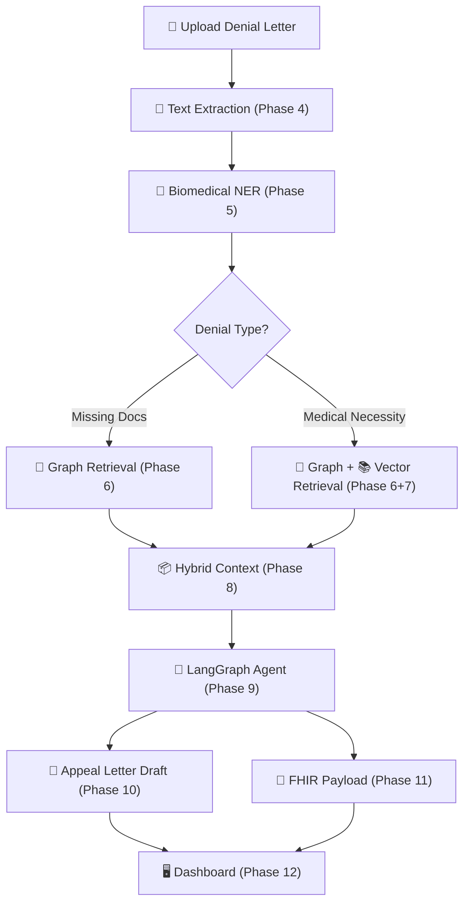

# AegisHealth-KG — Expanded Implementation Plan

AegisHealth-KG is an autonomous digital advocate that turns insurance claim denials into structured, legally grounded appeals. It combines a Knowledge Graph (for deterministic policy logic) with vector search (for medical literature evidence) and an LLM agent (for natural language appeal drafting).

---

## Open Questions

> [!WARNING]
> 1. **Graph Database**: Neo4j (richer ecosystem, APOC plugins) or Memgraph (faster in-memory)? **Recommendation: Neo4j** — better docs, wider community, easier to learn.
> 2. **LLM Provider**: OpenAI / Anthropic / Gemini / local model? This drives the LangGraph agent.
> 3. **Deployment Target**: Local Docker prototype first, or cloud from day one?

---

## Phase-by-Phase Breakdown

Each phase produces a **concrete, testable deliverable** you can run and inspect before moving on.

---

### Phase 0 — Scope, Data & Safety Definition

**What you'll understand after this phase:** *"We know exactly what the prototype will and won't do. The scope is bounded, the data is synthetic, and the success criteria are measurable."*

#### Project One-Liner

> A working proof-of-concept demonstrating hybrid Graph-RAG reasoning for insurance claim appeals across three representative clinical scenarios, using synthetic data only.

#### Prototype Scope Boundaries

| Dimension | Bounded To |
|---|---|
| Procedures | 3 (CGM, MRI, Outpatient Therapy) |
| Diagnoses | 3–5 ICD-10 codes |
| Insurance Policies | 3 mock policies (one per scenario) |
| Denial Types | 3 CARC codes |
| Patient Records | 100% synthetic — **zero real PHI** |
| Payer APIs | Mock endpoints only (no live insurer connections) |

#### The Three Scenarios

Each scenario is designed to exercise a different architectural pathway through the system.

> [!IMPORTANT]
> **CARC codes vs. Mock denial categories:** Real CARC (Claim Adjustment Reason Code) codes are standardized industry codes that describe *why a payer adjusted a claim*. They do **not** encode the full policy logic behind the denial. Our system pairs each CARC code with an explicit **mock denial category** that our policy graph defines. The CARC tells us *what happened*; the mock category tells us *what policy rule to reason about*.

**Scenario 1 — Type 2 Diabetes → Continuous Glucose Monitoring (CGM)**
| Element | Value |
|---|---|
| Diagnosis | `E11.9` — Type 2 Diabetes Mellitus without complications |
| Procedure | `CPT-95251` — Continuous Glucose Monitoring |
| CARC Code | `CO-167` — Diagnosis(es) is (are) not covered by this payer/contractor |
| Mock Denial Category | `STEP_THERAPY_NOT_SATISFIED` |
| Mock Policy Rule | Patient must document failure of Metformin AND a sulfonylurea before CGM is approved |
| **Tests** | **Multi-hop graph traversal** — the system must check 2 prerequisite drug failures before concluding eligibility |

**Scenario 2 — Knee Pain → MRI**
| Element | Value |
|---|---|
| Diagnosis | `M25.561` — Pain in right knee |
| Procedure | `CPT-73721` — MRI of lower extremity joint |
| CARC Code | `CO-197` — Precertification/authorization/notification absent |
| Mock Denial Category | `PRIOR_AUTH_MISSING` |
| Mock Policy Rule | Requires 6 weeks of documented conservative physical therapy before imaging approval |
| **Tests** | **Missing documentation path** — graph-only retrieval, no PubMed needed. The system identifies the paperwork gap |

**Scenario 3 — Major Depressive Disorder → Outpatient Therapy**
| Element | Value |
|---|---|
| Diagnosis | `F33.1` — Major Depressive Disorder, recurrent, moderate |
| Procedure | `CPT-90837` — Psychotherapy, 60 minutes |
| CARC Code | `CO-50` — These are non-covered services because this is not deemed a "medical necessity" |
| Mock Denial Category | `MEDICAL_NECESSITY_NOT_ESTABLISHED` |
| Mock Policy Rule | 20 sessions/year authorized without additional clinical review. Session 21+ requires documented medical necessity justification |
| Mock Denial Trigger | Session 21 denied under the session limit; payer does not provide additional clinical review |
| **Appeal Analysis** | Evaluate whether the denial/application of the session limitation is consistent with the mock policy and applicable parity rules. The legal-retrieval component retrieves relevant material (including the Mental Health Parity and Addiction Equity Act — MHPAEA) for the LLM to reference, rather than the system hard-coding a legal conclusion |
| **Tests** | **Medical necessity + legal retrieval path** — requires PubMed vector search for clinical evidence supporting continued therapy AND retrieval of applicable legal/regulatory material (MHPAEA). The system does NOT assume that citing a law automatically determines eligibility |

#### CARC Code + Mock Category Reference

> [!NOTE]
> The CARC code identifies the *payer's stated reason*. The mock denial category is our system's internal label that routes the claim to the correct reasoning pathway in the Knowledge Graph. The **mock policy document** is the authoritative source for the rules — not the CARC code.

| CARC Code | Standard CARC Description | Mock Denial Category | Reasoning Pathway |
|---|---|---|---|
| `CO-167` | Diagnosis(es) is (are) not covered by this payer/contractor | `STEP_THERAPY_NOT_SATISFIED` | Graph: multi-hop prerequisite check |
| `CO-197` | Precertification/authorization/notification absent | `PRIOR_AUTH_MISSING` | Graph: documentation requirement check |
| `CO-50` | Non-covered services; not deemed a "medical necessity" | `MEDICAL_NECESSITY_NOT_ESTABLISHED` | Graph + Vector: policy evaluation + PubMed evidence + legal retrieval |

#### Synthetic Data Policy

> [!CAUTION]
> **No real patient data (PHI) will be used at any point.** All patient records, clinical notes, and denial letters are fabricated for demonstration purposes. Using synthetic data ensures that the prototype does not process real PHI, avoiding the need to implement production HIPAA safeguards for this academic prototype.

We will create:
- **3 synthetic patient profiles** (one per scenario) with realistic but fictional demographics
- **3 mock denial letters** (PDF format) with proper formatting matching real EOB documents
- **3 mock insurance policy documents** — these are the **authoritative source** for all rules the system reasons about. Each contains explicit, machine-parseable coverage criteria, session limits, step-therapy requirements, and documentation requirements
- **Clinical notes** for each patient documenting their treatment history

#### Success Criteria

The prototype is **"working"** when, for each of the 3 scenarios, the following input→output chain produces correct results:

```
Input: Synthetic denial letter (PDF)
   ↓
System processing
   ↓
Expected: Correct extraction, correct reasoning, grounded output
```

**Component-Level Success Table:**

| Component | Metric | Pass Condition |
|---|---|---|
| ICD-10 Extraction | Extracted codes match denial letter | All expected codes extracted, no spurious codes |
| CPT Extraction | Extracted codes match denial letter | All expected codes extracted, no spurious codes |
| Denial Code Extraction | CARC code + mock category correctly identified | Exact match to synthetic denial |
| Graph Reasoning | Missing criteria / policy violations identified | All expected requirements identified — **no invented requirements** |
| Vector Retrieval | PubMed evidence relevance (Scenario 3) | Relevant evidence appears in Top-K results |
| Appeal Letter | Required sections present | Admin headers, clinical rebuttal, legal citations, bibliography — all present |
| Citation Accuracy | All citations traceable to source data | Every policy rule, legal reference, and PubMed citation **must exist in the supplied source data** |
| FHIR Payload | Schema validation | Passes FHIR R4 schema validation |

#### Grounded Generation Requirement

> [!CAUTION]
> **The system must not invent missing criteria, policy rules, medical evidence, or legal citations.**
>
> This is one of the project's most critical evaluation criteria. The LLM is used for *natural language synthesis*, not for *inventing medical or legal facts*.

**Specific prohibitions:**

| Source Data Says | System Must NOT Produce |
|---|---|
| Policy requires 6 weeks physical therapy | "12 weeks physical therapy" (inflated requirement) |
| PubMed abstract does not mention the treatment | LLM claims the abstract supports the treatment (hallucinated evidence) |
| Mock policy has 3 requirements | System reports 4 or 5 requirements (invented criteria) |
| MHPAEA is retrieved as relevant legal material | System claims MHPAEA "guarantees" the patient's eligibility (overreach) |

**Enforcement approach:**
- All graph-derived facts (missing criteria, policy rules, statutory citations) come directly from the Knowledge Graph — the LLM does not generate these
- All PubMed citations come from the FAISS retrieval results — the LLM may summarize but must not fabricate DOIs or paper titles
- Legal references come from a curated set of documents in the system — the LLM selects and cites but does not invent legal text
- Automated tests will compare system output against **ground-truth answer keys** defined per scenario

#### Explicitly Out of Scope (for prototype)

- ❌ Real insurance payer API connections
- ❌ Real patient data / HIPAA compliance infrastructure
- ❌ Full ICD-10/CPT code coverage (there are ~70,000 ICD-10 codes)
- ❌ Multi-language support
- ❌ User authentication / multi-tenancy
- ❌ Production deployment / scaling

#### Deliverable

A `docs/SCOPE.md` file committed to the repo documenting everything above, plus the full synthetic data directory:

```
data/synthetic/
│
├── denial_letters/
│   ├── scenario_1_denial.pdf
│   ├── scenario_2_denial.pdf
│   └── scenario_3_denial.pdf
│
├── policies/
│   ├── scenario_1_policy.md
│   ├── scenario_2_policy.md
│   └── scenario_3_policy.md
│
├── patients/
│   ├── scenario_1_patient.json
│   ├── scenario_2_patient.json
│   └── scenario_3_patient.json
│
└── answer_keys/
    ├── scenario_1_expected.json
    ├── scenario_2_expected.json
    └── scenario_3_expected.json
```

**Example answer key** (`scenario_1_expected.json`):

```json
{
  "scenario": 1,
  "description": "Type 2 Diabetes → CGM (Step Therapy)",
  "expected_entities": {
    "icd10": ["E11.9"],
    "cpt": ["95251"],
    "carc": ["CO-167"]
  },
  "expected_category": "STEP_THERAPY_NOT_SATISFIED",
  "expected_requirements": [
    "failure_of_metformin",
    "failure_of_sulfonylurea"
  ],
  "expected_missing_requirements": [],
  "expected_appeal_sections": [
    "administrative_header",
    "clinical_rebuttal",
    "legal_citations",
    "annotated_bibliography"
  ],
  "grounding_check": {
    "no_invented_requirements": true,
    "all_citations_from_source": true,
    "no_hallucinated_evidence": true
  }
}
```

> [!TIP]
> These answer keys become the foundation for automated regression tests in later phases. Every time the pipeline changes, we re-run all 3 scenarios and assert that outputs match the answer keys.

---

### Phase 1 — Project Skeleton & Dev Environment

**What you'll understand after this phase:** *"The project folder is set up, dependencies are locked, and I can run a hello-world API."*

| Item | Detail |
|---|---|
| Initialize Python project | `pyproject.toml` with Poetry/pip, `.gitignore`, `README.md` |
| Create folder structure | `src/aegis/` with sub-packages: `api/`, `graph/`, `extraction/`, `vector/`, `agent/`, `fhir/`, `models/`, `config/` |
| FastAPI hello-world | A single `/health` endpoint returning `{"status": "ok"}` |
| Configuration | Pydantic `Settings` class loading from `.env` (DB URIs, API keys) |
| Linting & formatting | `ruff` config, `pre-commit` hooks |

**Deliverable:** `uvicorn src.aegis.api.main:app --reload` starts and `/health` returns 200.
I'd just add tests/, .env.example, and use uv consistently for dependency management
---

### Phase 2 — Infrastructure via Docker Compose

**What you'll understand after this phase:** *"Neo4j is running locally and I can open its browser UI. FAISS is ready to be used in-process."*

| Item | Detail |
|---|---|
| `docker-compose.yml` | Services: `neo4j` (with APOC plugin), `api` (our FastAPI app) |
| Neo4j health check | Compose waits for Neo4j bolt port before starting the API |
| FAISS setup | FAISS is an in-process library — we add `faiss-cpu` to dependencies (no separate container) |
| Volume mounts | Persistent volumes for Neo4j data and a `data/` folder for uploaded documents |

**Deliverable:** `docker compose up` launches Neo4j at `localhost:7474` and the API at `localhost:8000`.

---

### Phase 3 — Knowledge Graph Schema & Seed Data

**What you'll understand after this phase:** *"I can open Neo4j Browser and visually see nodes like Diagnosis, Procedure, and PolicyRule connected by edges like INDICATED_FOR and MANDATES."*

| Item | Detail |
|---|---|
| Schema definition | Python dataclasses/Pydantic models for every node type: `Diagnosis`, `Procedure`, `PolicyRule`, `Requirement`, `Patient`, `ClinicalNote`, `Payer`, `Provider` |
| Edge definitions | `INDICATED_FOR`, `REQUIRES_DOCUMENTATION`, `MANDATES`, `REQUIRES`, `HAS_RECORD`, `EVIDENCES`, `COVERED_BY`, `FILED_BY` |
| Neo4j driver wrapper | `src/aegis/graph/client.py` — thin async wrapper around the official `neo4j` Python driver |
| Seed script | `scripts/seed_graph.py` — loads ~20 realistic nodes & relationships covering 3 sample scenarios (e.g., Type 2 Diabetes → CGM, Knee Pain → MRI with step therapy, Mental Health → outpatient therapy) |
| Constraints & indexes | Unique constraints on code fields (`icd10`, `cpt`), full-text index on `PolicyRule.description` |

**Deliverable:** Run `python scripts/seed_graph.py`, then open Neo4j Browser → run `MATCH (n) RETURN n` → see the full graph visualized.

---

### Phase 4 — Document Upload & Text Extraction

**What you'll understand after this phase:** *"I can upload a PDF denial letter via the API and get back the raw extracted text."*

| Item | Detail |
|---|---|
| Upload endpoint | `POST /api/v1/documents/upload` accepting `multipart/form-data` (PDF, DOCX, plain text) |
| PDF parser | `PyMuPDF` (fitz) for PDF text extraction; fallback to `pytesseract` OCR for scanned documents |
| Text cleaner | Strip headers/footers, normalize whitespace, segment into paragraphs |
| Document storage | Save uploaded file to `data/uploads/` and extracted text to `data/extracted/` as JSON |
| Response model | Returns `{ document_id, filename, page_count, extracted_text_preview }` |

**Deliverable:** `curl -F "file=@denial_letter.pdf" localhost:8000/api/v1/documents/upload` → returns structured JSON with extracted text.

---

### Phase 5 — Biomedical Named Entity Recognition (NER)

**What you'll understand after this phase:** *"The system reads a denial letter and automatically pulls out the ICD-10 codes, CPT codes, denial reason codes, and payer names."*

| Item | Detail |
|---|---|
| NER pipeline | Load `d4data/biomedical-ner-all` from HuggingFace Transformers |
| Entity post-processor | Map raw NER spans to structured categories: `diagnosis_codes` (ICD-10), `procedure_codes` (CPT/HCPCS), `denial_reasons` (CO-xxx, PR-xxx), `payer_name`, `provider_npi` |
| Regex augmentation | Regex patterns to catch codes the NER model might miss (e.g., `E11.9`, `CPT-95251`, `CO-197`) |
| Extraction endpoint | `POST /api/v1/documents/{document_id}/extract` → returns structured entity JSON |
| Unit tests | Test against 5 sample denial letter texts with known expected entities |

**Deliverable:** Upload a denial letter → call extract → get back `{"icd10": ["E11.9"], "cpt": ["95251"], "denial_codes": ["CO-197"], "payer": "Aetna"}`.

---

### Phase 6 — Graph Retrieval Engine (Pass 1: Deterministic Logic)

**What you'll understand after this phase:** *"Given the codes from the denial letter, the system queries the Knowledge Graph and tells me exactly WHICH policy requirements the patient is missing and WHY the claim was denied."*

| Item | Detail |
|---|---|
| Cypher query builder | `src/aegis/graph/retrieval.py` — takes `(cpt_code, icd10_code, patient_id)` and constructs parameterized Cypher queries |
| Missing-criteria query | Finds all `Requirement` nodes linked to the procedure's `PolicyRule` that the patient's records do NOT satisfy |
| Full policy path query | Returns the entire sub-graph path: `Diagnosis → Procedure → PolicyRule → Requirement` with statutory citations |
| Step-therapy checker | Special query for step-therapy rules: checks if patient has documented failures of prerequisite medications |
| API endpoint | `POST /api/v1/retrieval/graph` accepting extracted entities, returning `{ missing_criteria: [...], legal_basis: [...], policy_path: [...] }` |

**Deliverable:** Call the endpoint with `cpt=95251, icd10=E11.9` → get `{"missing_criteria": ["3-month log of hypoglycemic events"], "legal_basis": "State Insurance Code §1234.5"}`.

---

### Phase 7 — Vector Retrieval Engine (Pass 2: PubMed Evidence)

**What you'll understand after this phase:** *"When a denial says 'not medically necessary', the system searches millions of PubMed abstracts and finds peer-reviewed studies that support the treatment."*

| Item | Detail |
|---|---|
| Embedding model | Load `MedEmbed-small-v0.1` (or `all-MiniLM-L6-v2` as fallback) via `sentence-transformers` |
| PubMed corpus loader | Script `scripts/index_pubmed.py` — downloads a subset of PubMed Central abstracts (~50K for prototype), embeds them, and stores in a FAISS index |
| Vector search service | `src/aegis/vector/retrieval.py` — takes a clinical query string, returns top-K most relevant abstracts with similarity scores |
| Citation formatter | Extracts PMID, DOI, title, authors, and relevant excerpt from each result |
| API endpoint | `POST /api/v1/retrieval/vector` accepting a natural-language query, returning `{ results: [{ title, doi, excerpt, score }] }` |

**Deliverable:** Query `"continuous glucose monitoring efficacy type 2 diabetes"` → get 5 ranked PubMed abstracts with DOI links.

---

### Phase 8 — Unified Hybrid Retrieval Service

**What you'll understand after this phase:** *"One API call takes the denial letter entities and returns BOTH the exact policy gaps from the graph AND the supporting medical evidence from PubMed, merged into a single context package."*

| Item | Detail |
|---|---|
| Orchestrator | `src/aegis/retrieval/hybrid.py` — runs Pass 1 (graph) and Pass 2 (vector) in parallel |
| Decision logic | If graph returns `denial_type == "missing_documentation"` → skip vector pass. If `denial_type == "medical_necessity"` → run both passes |
| Context assembler | Merges graph results + vector results into a single `RetrievalContext` dataclass with sections: `missing_criteria`, `policy_citations`, `supporting_literature` |
| API endpoint | `POST /api/v1/retrieval/hybrid` — single entry point for the full retrieval pipeline |

**Deliverable:** One call with `{cpt, icd10, patient_id, denial_reason}` → returns the complete evidence package ready for appeal drafting.

---

### Phase 9 — LangGraph Agent State Machine

**What you'll understand after this phase:** *"There's an AI agent that follows a strict workflow: ingest → extract → retrieve → draft. It doesn't hallucinate steps because the state machine enforces the order."*

| Item | Detail |
|---|---|
| State definition | `AgentState` TypedDict with fields: `document_id`, `extracted_entities`, `retrieval_context`, `draft_appeal`, `fhir_payload`, `current_phase`, `errors` |
| Graph nodes | Python functions for each step: `ingest_node`, `extract_node`, `graph_retrieve_node`, `vector_retrieve_node`, `draft_node`, `fhir_node` |
| Conditional edges | After `extract`: route to `graph_retrieve`. After `graph_retrieve`: if medical necessity denial → also run `vector_retrieve`, else skip to `draft`. After `draft`: route to `fhir_node` or `end` |
| Error handling | Each node catches exceptions and writes to `state.errors`; a fallback edge routes to a `human_review` terminal state |
| Compilation | `langgraph.compile()` produces a runnable graph |

**Deliverable:** `python -m src.aegis.agent.run --document sample_denial.pdf` prints the state at each transition, ending with a draft appeal.

---

### Phase 10 — Appeal Letter Generation (LLM Drafting)

**What you'll understand after this phase:** *"The system produces a formal, multi-page appeal letter with admin headers, a clinical rebuttal, legal citations, and an annotated bibliography — all auto-generated."*

| Item | Detail |
|---|---|
| Prompt templates | Jinja2 templates for each appeal section: `header.j2`, `clinical_rebuttal.j2`, `legal_citations.j2`, `bibliography.j2` |
| LLM integration | Call the chosen LLM with structured prompts containing the `RetrievalContext` data |
| Output parser | Parse the LLM response into structured sections; validate that all required fields (NPI, claim ID, patient ID) are present |
| PDF renderer | Use `reportlab` or `weasyprint` to render the appeal as a downloadable PDF |
| API endpoint | `POST /api/v1/appeals/generate` — takes a `document_id`, runs the full pipeline, returns the appeal as PDF + JSON |

**Deliverable:** Upload a denial letter → get back a polished, multi-page appeal PDF with real citations.

---

### Phase 11 — FHIR Payload Generation

**What you'll understand after this phase:** *"The system can also output the appeal as a machine-readable FHIR JSON payload that can be submitted electronically to insurance payers."*

| Item | Detail |
|---|---|
| FHIR models | Pydantic models for `ClaimResponse`, `PriorAuthorizationRequest`, `Bundle` resources following USCDI v3 / Da Vinci PAS IG |
| Graph-to-FHIR mapper | `src/aegis/fhir/mapper.py` — converts the agent's `RetrievalContext` + `draft_appeal` into FHIR resources |
| Validation | Validate generated JSON against FHIR R4 schema (using `fhir.resources` library) |
| Mock payer endpoint | A simple FastAPI route simulating a payer's Da Vinci PAS API for testing |
| API endpoint | `GET /api/v1/appeals/{appeal_id}/fhir` → returns the FHIR JSON bundle |

**Deliverable:** After generating an appeal, fetch `/fhir` → get a valid FHIR `Bundle` JSON that passes schema validation.

---

### Phase 12 — Frontend Dashboard & End-to-End Polish

**What you'll understand after this phase:** *"There's a web UI where I can upload a denial letter, watch the system process it step by step, and download the finished appeal."*

| Item | Detail |
|---|---|
| Dashboard UI | Single-page app (HTML/CSS/JS or React) with: upload form, processing status timeline, results viewer |
| Status timeline | Visual pipeline showing: Upload ✓ → Extract ✓ → Graph Search ✓ → PubMed Search ✓ → Draft ✓ → FHIR ✓ |
| Results viewer | Tabs: "Appeal Letter" (rendered PDF preview), "FHIR Payload" (JSON viewer), "Evidence" (list of PubMed citations), "Graph Path" (visual sub-graph) |
| Download buttons | Download appeal as PDF, FHIR as JSON |
| Error display | If any phase fails, show clear error message with guidance |
| End-to-end tests | Playwright/Cypress tests for the full upload-to-download flow |

**Deliverable:** Open `localhost:3000` → upload a denial letter → watch progress → download the appeal.

---

## Project Folder Structure (Final)

```
AegisHealth-KG/
├── docker-compose.yml
├── Dockerfile
├── pyproject.toml
├── .env.example
├── README.md
├── scripts/
│   ├── seed_graph.py          # Phase 3: Load sample data into Neo4j
│   └── index_pubmed.py        # Phase 7: Build FAISS index from PubMed
├── data/
│   ├── uploads/               # Phase 4: Raw uploaded documents
│   ├── extracted/             # Phase 4: Extracted text JSON
│   └── faiss_index/           # Phase 7: FAISS index files
├── src/aegis/
│   ├── __init__.py
│   ├── config/
│   │   └── settings.py        # Phase 1: Pydantic Settings
│   ├── models/
│   │   ├── entities.py        # Phase 5: Extracted entity models
│   │   ├── graph_models.py    # Phase 3: Node/edge dataclasses
│   │   └── fhir_models.py     # Phase 11: FHIR Pydantic models
│   ├── api/
│   │   ├── main.py            # Phase 1: FastAPI app
│   │   ├── routes/
│   │   │   ├── documents.py   # Phase 4: Upload endpoints
│   │   │   ├── extraction.py  # Phase 5: NER endpoints
│   │   │   ├── retrieval.py   # Phase 6-8: Retrieval endpoints
│   │   │   ├── appeals.py     # Phase 10: Appeal generation
│   │   │   └── fhir.py        # Phase 11: FHIR endpoints
│   ├── extraction/
│   │   ├── parser.py          # Phase 4: PDF text extraction
│   │   └── ner.py             # Phase 5: Biomedical NER pipeline
│   ├── graph/
│   │   ├── client.py          # Phase 3: Neo4j driver wrapper
│   │   └── retrieval.py       # Phase 6: Cypher query builder
│   ├── vector/
│   │   ├── embedder.py        # Phase 7: MedEmbed wrapper
│   │   └── retrieval.py       # Phase 7: FAISS search service
│   ├── retrieval/
│   │   └── hybrid.py          # Phase 8: Unified retrieval orchestrator
│   ├── agent/
│   │   ├── state.py           # Phase 9: AgentState definition
│   │   ├── nodes.py           # Phase 9: State machine node functions
│   │   ├── graph.py           # Phase 9: LangGraph compilation
│   │   └── run.py             # Phase 9: CLI entry point
│   ├── appeal/
│   │   ├── templates/         # Phase 10: Jinja2 prompt templates
│   │   ├── generator.py       # Phase 10: LLM appeal drafting
│   │   └── renderer.py        # Phase 10: PDF rendering
│   └── fhir/
│       ├── mapper.py          # Phase 11: Graph-to-FHIR conversion
│       └── validator.py       # Phase 11: FHIR schema validation
├── frontend/                  # Phase 12: Dashboard UI
│   ├── index.html
│   ├── style.css
│   └── app.js
└── tests/
    ├── test_extraction.py     # Phase 5
    ├── test_graph_retrieval.py# Phase 6
    ├── test_vector_retrieval.py# Phase 7
    ├── test_agent.py          # Phase 9
    └── test_fhir.py           # Phase 11
```

---

## Visual Architecture



---

## Verification Plan

### Per-Phase Testing
| Phase | Test |
|---|---|
| 1 | `/health` returns 200 |
| 2 | `docker compose up` succeeds, Neo4j browser accessible |
| 3 | `MATCH (n) RETURN n` shows seeded graph in Neo4j Browser |
| 4 | Upload a PDF → get extracted text back |
| 5 | Extract entities from sample text → match expected ICD-10/CPT codes |
| 6 | Query graph with codes → get missing criteria list |
| 7 | Search PubMed index → get relevant abstracts |
| 8 | Hybrid call returns merged context |
| 9 | Agent runs full pipeline without errors |
| 10 | Appeal PDF downloads with all required sections |
| 11 | FHIR JSON passes schema validation |
| 12 | End-to-end: upload → see progress → download appeal in browser |

### Final Integration Test
Upload a real-world-style denial letter and verify the system produces a complete appeal package (PDF + FHIR JSON) with accurate policy citations and relevant medical literature.